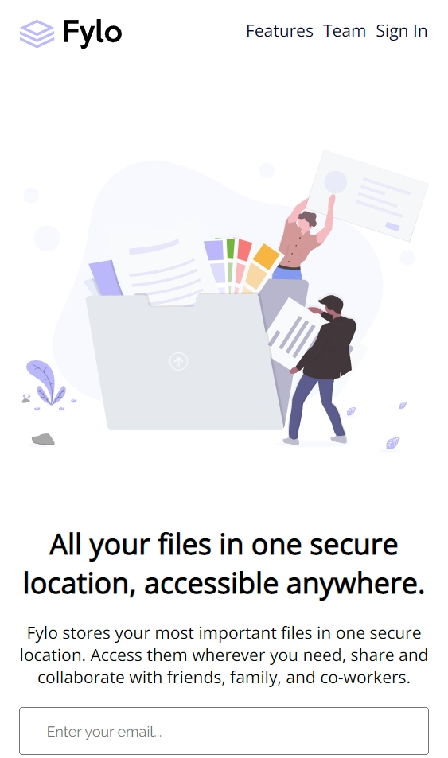
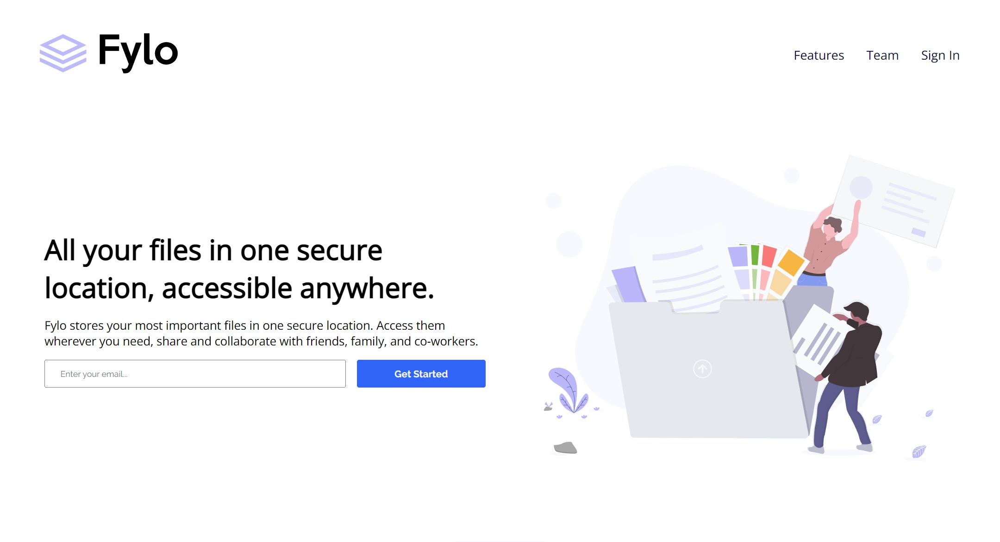

# Frontend Mentor - Fylo landing page with two column layout solution

This is a solution to the [Fylo landing page with two column layout challenge on Frontend Mentor](https://www.frontendmentor.io/challenges/fylo-landing-page-with-two-column-layout-5ca5ef041e82137ec91a50f5). Frontend Mentor challenges help you improve your coding skills by building realistic projects. 

## Table of contents

- [Frontend Mentor - Fylo landing page with two column layout solution](#frontend-mentor---fylo-landing-page-with-two-column-layout-solution)
  - [Table of contents](#table-of-contents)
  - [Overview](#overview)
    - [The challenge](#the-challenge)
    - [Screenshot](#screenshot)
    - [Links](#links)
  - [My process](#my-process)
    - [Built with](#built-with)
    - [What I learned](#what-i-learned)
    - [Continued development](#continued-development)
  - [Author](#author)

## Overview

### The challenge

Users should be able to:

- View the optimal layout for the site depending on their device's screen size
- See hover states for all interactive elements on the page

### Screenshot

### Links

- Solution URL: [GitHub](https://github.com/varonalearns/Fylo-landing-page-with-two-column-layout)
- Live Site URL: [Vercel](https://fylo-landing-page-with-two-column-layout-vert.vercel.app/)

## My process

### Built with

- Semantic HTML5 markup
- CSS custom properties
- Flexbox
- CSS Grid
- Mobile-first workflow

### What I learned

With this project, I learned to think ahead and better prepare structuring this project. I had a much easier time with this project than the last, mainly because I really thought of what needed to change as the screen sized changed. I also wanted to pay more attention to using semantic HTML and prepping for different colored SVGs.

### Continued development

In the future, I want to continue to think ahead and place the framing correctly before pouring in the foundation. I need to prep for different colored SVGs for instance. That is something to think about in the future. 

## Author

- Website - [Evalia Varona](https://www.evaliavarona.com)
- Frontend Mentor - [@varonalearns](https://www.frontendmentor.io/profile/varonalearns)
- Hashnode - [@evavarona](https://evaliavarona.hashnode.dev/)
